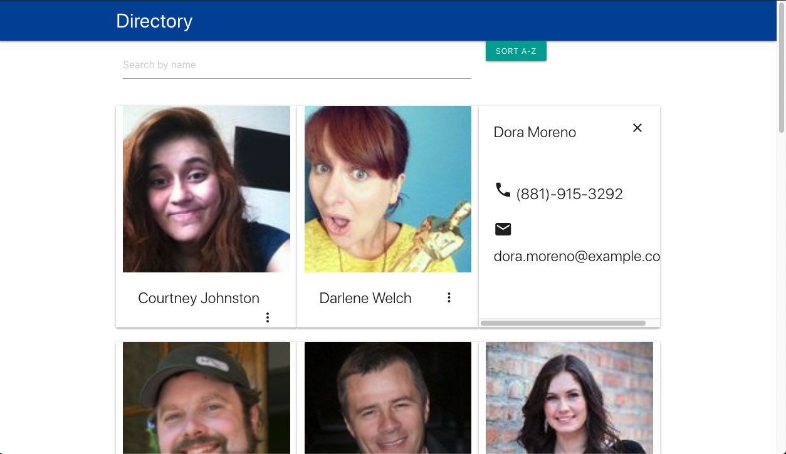

# Employee Directory

## Description

This is an employee directory built with React. The application's UI is broken up into components that respond to user events such as filtering reslults based on name or sorting results alphabetically.

Screenshot of application:

Link to deployed app, [here](http://nard1n.github.io/employee-directory)

## Table of Contents

* [Installation](#Installation)
* [Usage](#Usage)
* [Contributing](#Contributing)
* [Tests](#Tests)
* [License](#License)
* [Questions](#Questions)

## Installation
Feel free to clone this repository and use it as your daily planner or use it to practive your code

## Usage
The app allows the user the ability to search a directory of employees (currently pulls from a random data generating API). eThe user can use the search bar to search for a specific employee from the results on the page, or can sort the results in an alphabetical order.

## Contributing
We love seeing community contribution to any opensource project! If you would like to contribute, please do.

## Tests
Unit tests included in test files. Make sure when making edits that all unit tests pass.

## License
This project is released under BSD 2 Clause opensource license:

https://opensource.org/licenses/BSD-2-Clause

## Questions
For more about my work, check out my Github profile: https://github.com/nard1n

If you have any questions and would like to chat, please feel free to send me an email directly to nardincodes@gmail.com